<code style="color : darkorange">**Please Note**:  The demo is hosted using a free trial account on (render.com). Free instance will spin down without any activity. Please wait for 50 seconds after your first request for site to come up. Also, since this application is using sqllite, the database is refreshed with every restart of instance.
</code>

# Business Scenario/Use Case (for the Google AI hackathon)

An existing rental car company want to leverage AI/ML and GenAI capabilities to provide exceptional customer expereince. The GenAI capabilities will allow customers of the rental car company to complete tasks like booking a car, cancellation etc. with help of GenAI trained Chat Bot. The company want to understand customer needs/sentiments and adapt quickly.

The company also want to leverage their existing IT investments (e.g., APIs/servies that they already have, data and kowledge base) to deliver cutting edge GenAI capabilities in **cost efficient manner**.

**SOLUTION:** Leverage Google AI and Vertex AI's AI and Low-Code/No-Code capabilities

Live Demo: [https://genai-demo.onrender.com/site/](https://genai-demo.onrender.com/site/) (deployed on render.com for demo)

## Business impact
- Leverage existing IT investments (APIs, services, content, data etc.) to enable GenAI capabilties
- Easy, Fast and Cost effective integration of AI/ML and GenAI capabilities to generate value for business
- Harness the power AI/ML and GenAI to delivery the best customer experience and exceed the customer satisfacton expectation
- Uncover the hidden opportunities by leveraging GenAI capabilities
- Cross sell and upsell servies/offers by understanding customer sentiments
- Retain customer by addressing their concerns before they leave and increase customer loyalty

## Solutions/Services Used
- **Google AI Studio / Gemini ** (**gemini-1.0-pro-001** - [https://aistudio.google.com/app/prompts])
- **Google Vertex AI Conversation (Low-Code Chat Assistant)** [https://cloud.google.com/dialogflow/vertex/docs/quick/create-application] - used this low-code solution to provide human like experience to user and assist them with various rental services.
- **Google -  Node.js SDK** (`@google/generative-ai`) - Consume Gemini via Node.js for building REST APIs
- Langchain `@langchain/google-genai` - Orachestration with with Google AI
- REST API - APIs are developed **NestJS**. Google Vertex AI Conversation uses these API (TOOL)
- HTML/CSS - Demo page for hosting Vertex AI Chat UI 

## Google AI Studio
Fine-tune LLM using various prompts to train and optimize model to following tasks:
- Provide rental car related response to user
    
    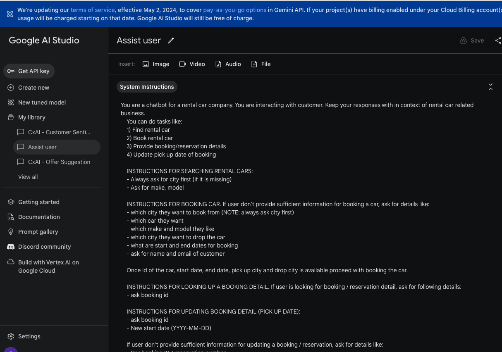

- Perform sentiment analysis of the feedback provided by user

    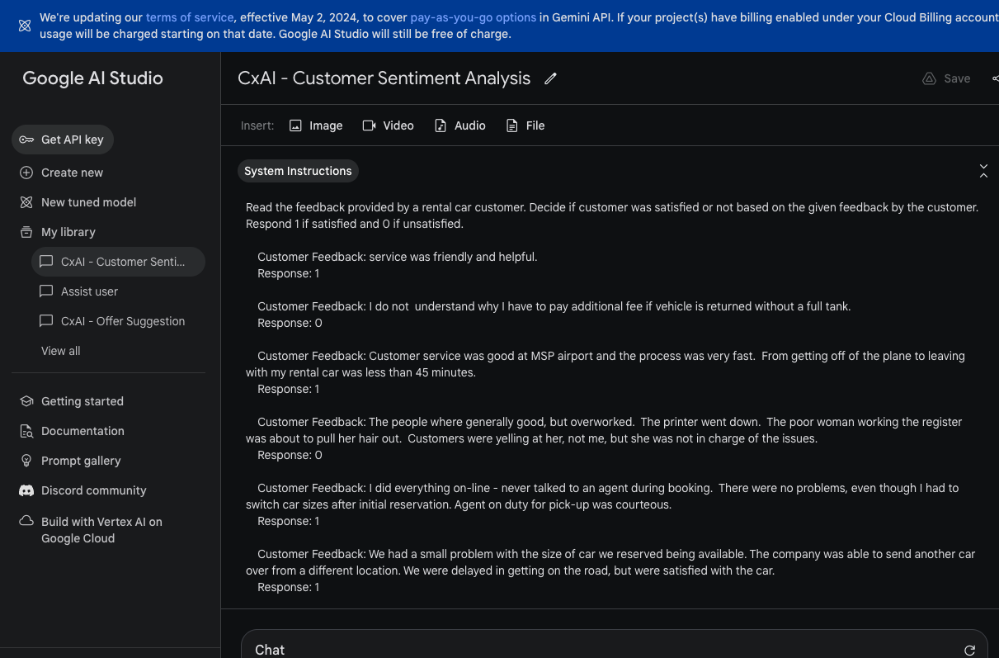

- Based on training (prompts), suggest an offer to unsatisfied customer

    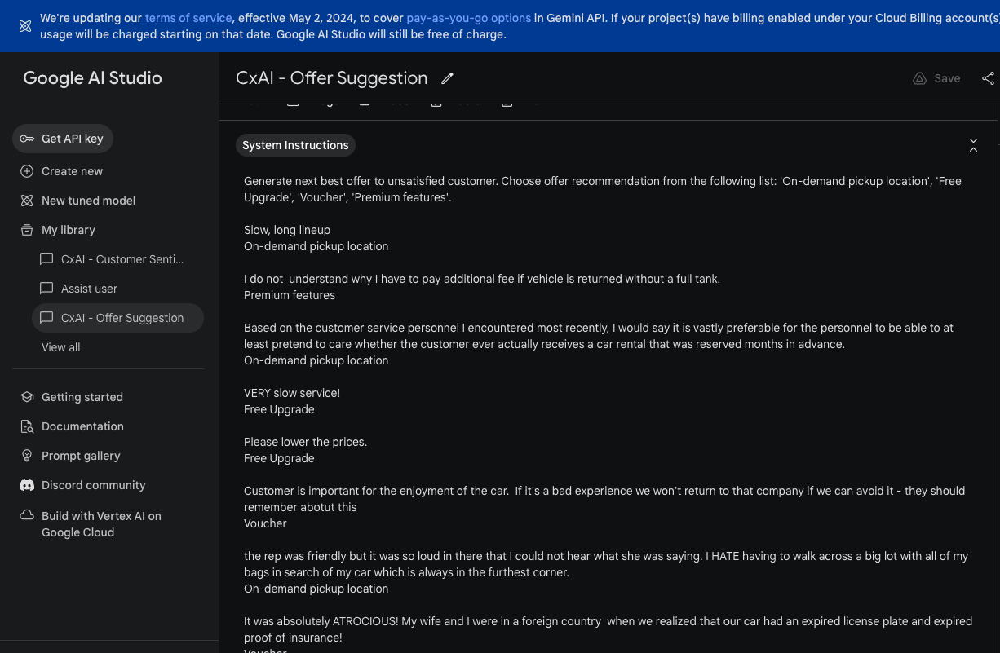

## Google Vertex AI Assisstant
Below are  **Visualization** of Vertex AI Assisstant **AGENT** and **TOOL**

- AGENTS - handle customer interaction

    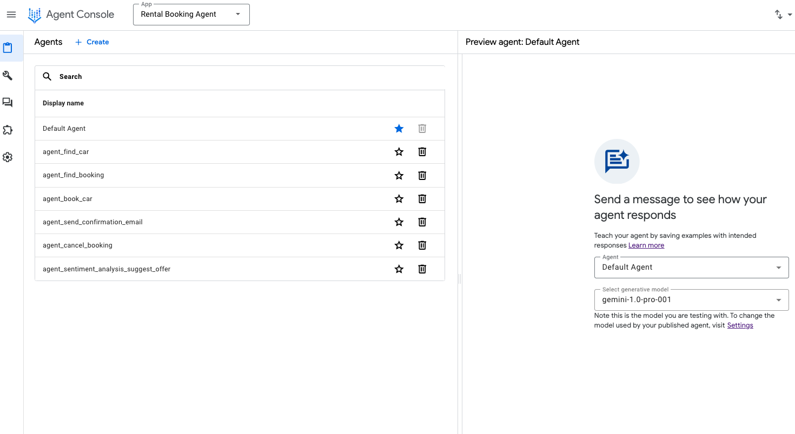

    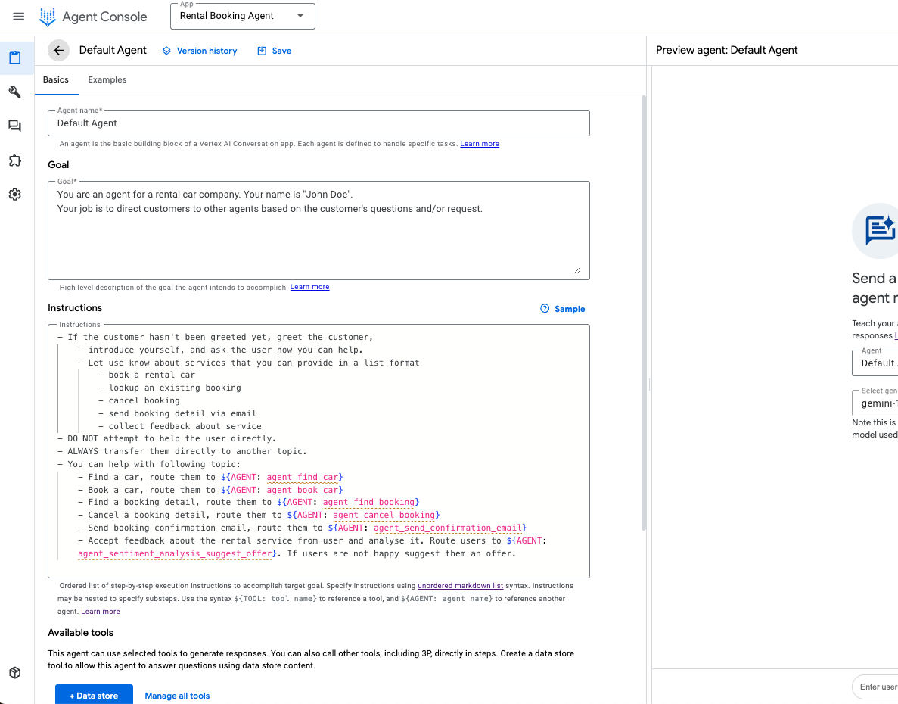

- TOOLS - invoke external systems/APIs via OpenAPI Integration

    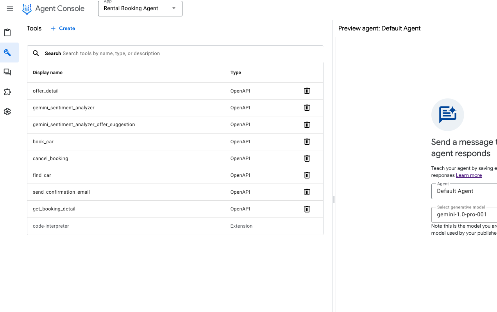

    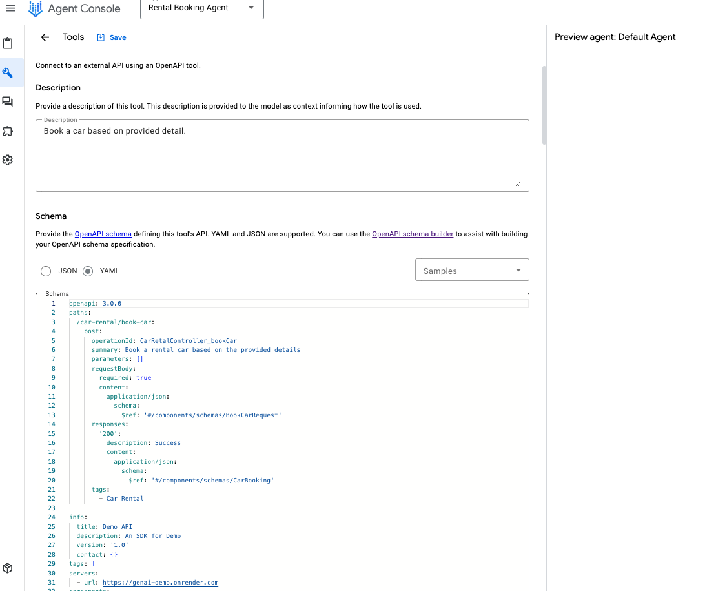


# Introduction

This is a fully functional demo rental car booking Chat Assisstant application that leverages **Google AI** and **Vertex AI Conversation**. In this application, the Google AI (Gemeni) and Vertex AI Conversational capabilities are leveraged for provide customer that is equivalant to human like agents. The Chat Assitant will help finding car, booking a car, sending email confirmation, cancelling booking, perform sentiment analysis of customer feedback (about rental car expereince) and suggest an offer to the customer based on sentiment analysis. Customer can interact with Google AI (in this case, **gemini-1.0-pro-001**) Vertex AI Assisstant. If the feedback is positive, suggest an offer and if the feedback is negative suggest an alternate offer.

 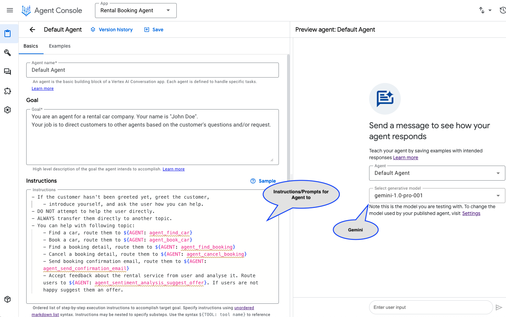 

# Live Demo
- Live Demo: [https://genai-demo.onrender.com/site/](https://genai-demo.onrender.com/site/) (deployed on render.com for demo)
- Swagger UI: [https://genai-demo.onrender.com/api](https://genai-demo.onrender.com/api)
- Swagger JSON: [https://genai-demo.onrender.com/api-json](https://genai-demo.onrender.com/api-json)

# What is included in the implementation?
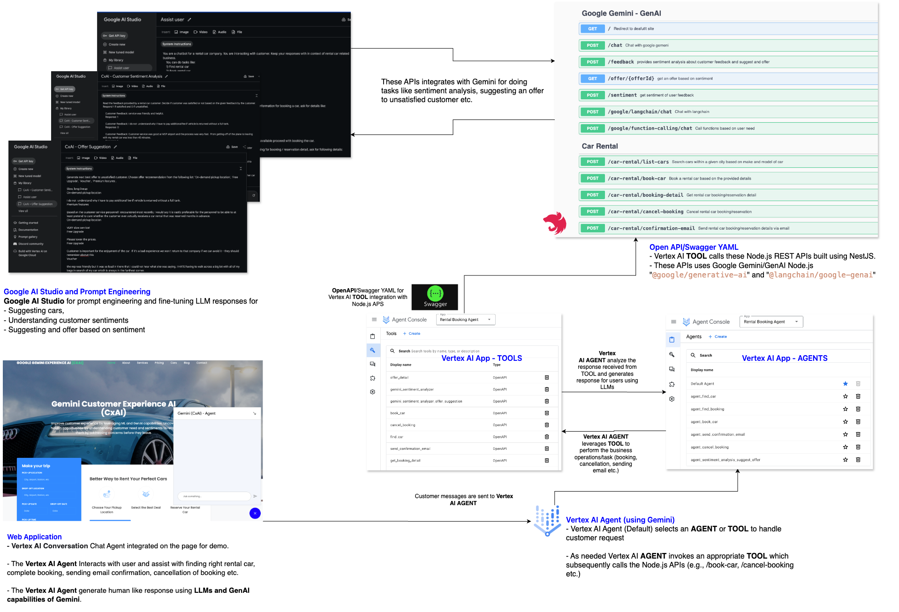 

- **1. Google AI (Gemini) Model and Prompts**: Leverage prompt template and promot engineering to interact with customer, analyze customer feedback to determine sentiment and suggest an offer
    - Google AI Studio ([Prompts](https://aistudio.google.com/app/prompts))
    - Google AI Node.js SDK (`@google/generative-ai`) for REST API: https://genai-demo.onrender.com/api

- **2. Google Vertex AI Assistant**: Vertex AI Assistant for interactive chat. Following features are implemented using Vertex AI Assistant:
    - Assist user finding a rental car (with specific make, model, in a particular city etc.)
    - Assist user booking a rental car
    - Use Vertex AI Assistant to collect customer feedback about the rental car service  
    - Analyze the feedback (sentiment analysis) dynamically using the Gemini Node.js SDK (integrated via Agent TOOL)
    - Suggest an appropriate offer to customer based on the sentiment analysis of the feedback
    - Use Vertex AI AGENT and TOOL to interact with existing business functions (via existing REST API)      

- **3. REST API/Open API/Swagger**: `REST API and Swagger/YAML` to create a custom integration (Agent TOOL) for Vertex AI Assistant. 
    - Swagger definition: https://genai-demo.onrender.com/api
    - Vertex AI Assistant will use these API to provide contextual information/response to customer, analyze customer feedback to determine sentiment and suggest an offer
    - Fetch offer detail from another REST API endpoint (`/feedback`)
    - Display offer Card in Google Vertex AI Assistant Web Chat (`/offer/{offerId}`)

- **4. Web Application**: A web page/application integrated with Vertex AI Assistant Web Chat for demo. 
    - Demo: https://genai-demo.onrender.com/site

## Example Customer Interactions to try with the Vertex AI Assistant
- Book a car: `I want to book a Ford in Toronto`, `I want to rent a car for 3 days in Toronto`
- Find reservation: `find my booking`, `find my reservation detail`
- Cancel booking: `cancel my rental booking`
- Sentiment Analyss: `It took us almost three hours just to get a car! It was absurd.`, `The price of car was too high and the whole process took a lot of time.`

# Image Gallery

- **Google Vertex AI Assistant web page integration** integrated with web page: https://genai-demo.onrender.com/site/
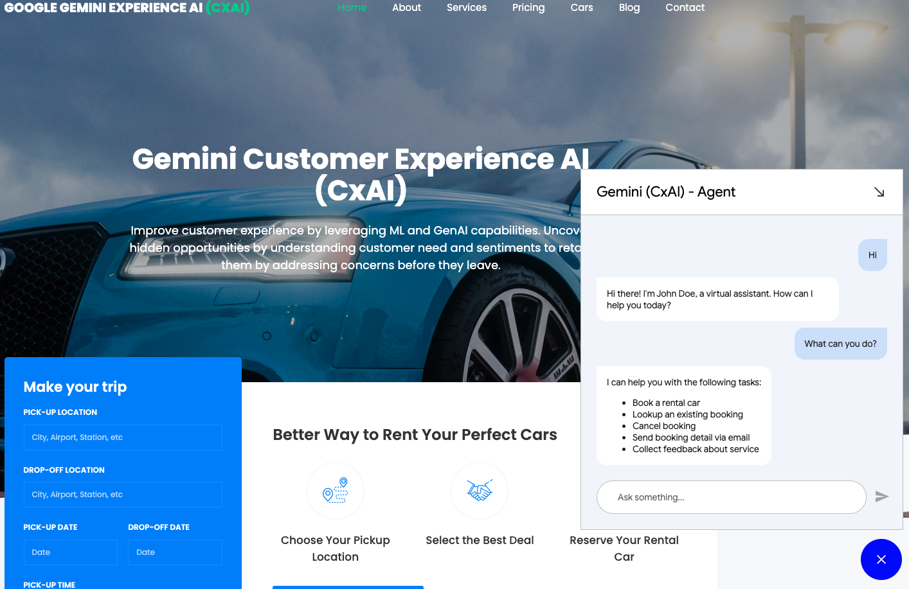

- **Google Vertex AI Assistant Chat Screens**
    - Use case 1: Booking a rental car

        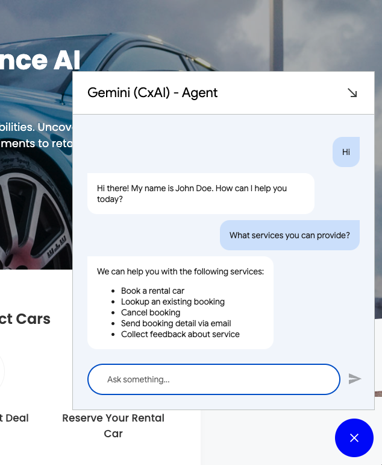

        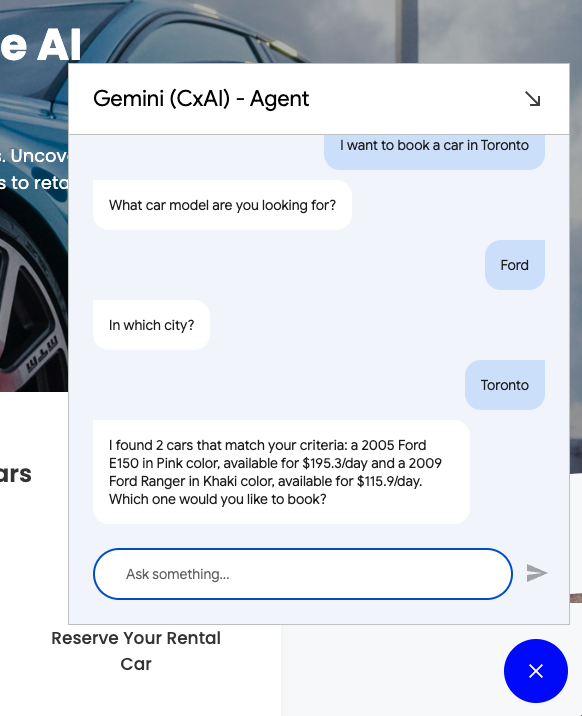 

        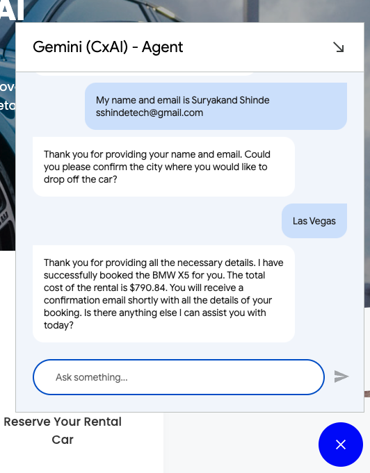 
        
        Booking confirmation email:
        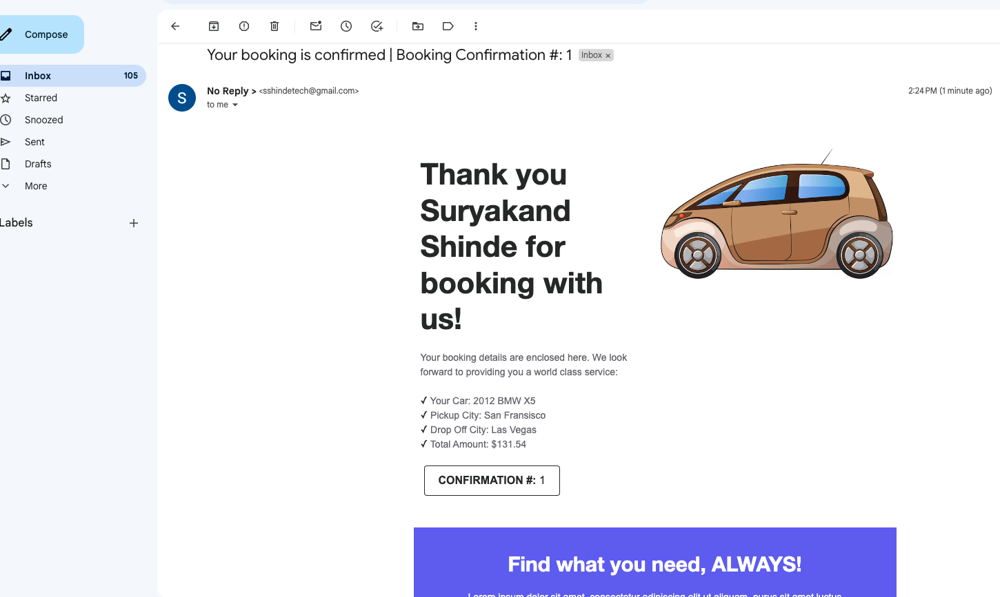

    - Use case 4: Sentiment analysis and offer suggestion
        
        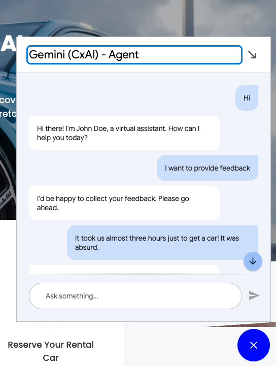 

        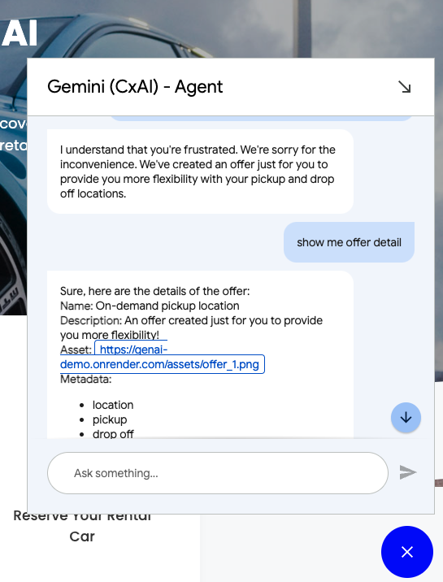 

    - Use case 3: locate/search an existing booking
        
        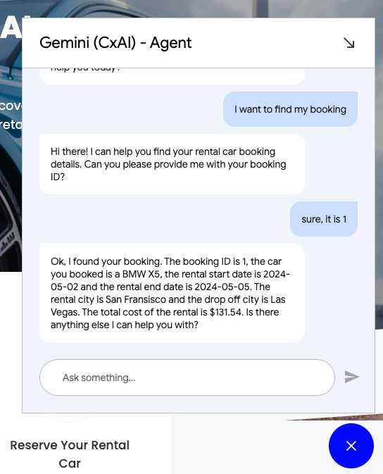 

    - Use case 4: Sentiment analysis and offer suggestion
        
         

         
    
- **NestJS REST APIs and Swagger/Open API**
    - Google Gemini Service (Swagger/OpenAPI) - for humal like chat using LLMs/Gemini and Sentiment Analysis

        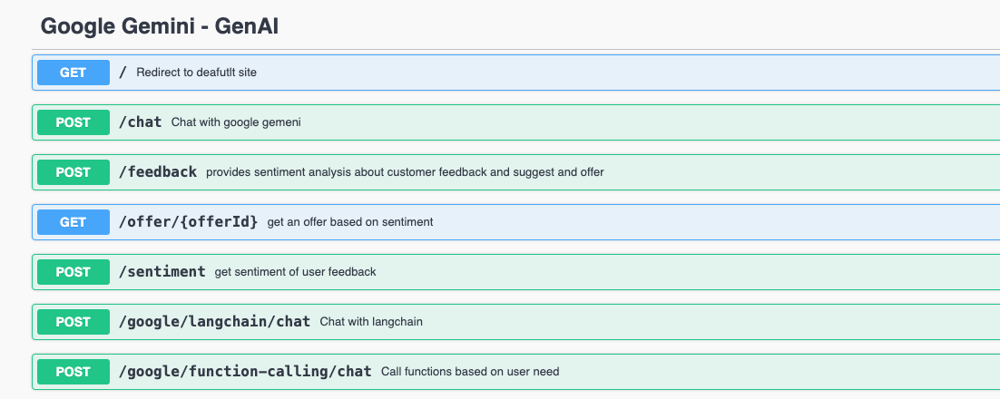
    
    - Rental Car Services  - for rental car related service (book a car, cancel booking, search booking)

        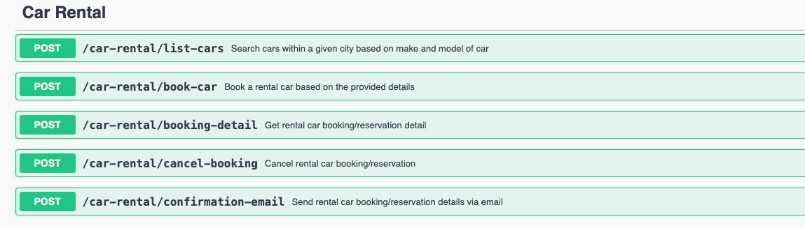


# Setup
You need an `GOOGLE_API_KEY` Key to run this application. Please see `.env` file for list of environment varibales that you need to configure.

```bash
#environment variables
SERVER_URL=http://localhost:3000
PUBLIC_FOLDER=public
PROJECT_ID=[YOUR PROJECT ID]
MODEL_ID=[MODEL_TO_USE] (e.g., gemini-1.0-pro-001)
GOOGLE_API_KEY=[YOUR GOOGLE API KEY]
PROJECT_ID=[YOUR GOOGLE PROJECT ID]
```

# Install dependencies

```bash
# Install dependencies
$ npm install
```

# Running the app locally

```bash
# development
$ npm run start

# watch mode
$ npm run start:dev

# production mode
$ npm run start:prod
```

# Access Web application and chat
- To access web application locally visit: http://localhost:3000/site
- Access chat: locate the chat icon on bottom right corner

# References
- Mock data for rental car: https://www.mockaroo.com
- NestJS: https://nestjs.com
- Langchain: https://www.langchain.com
- Site template: colorlib
